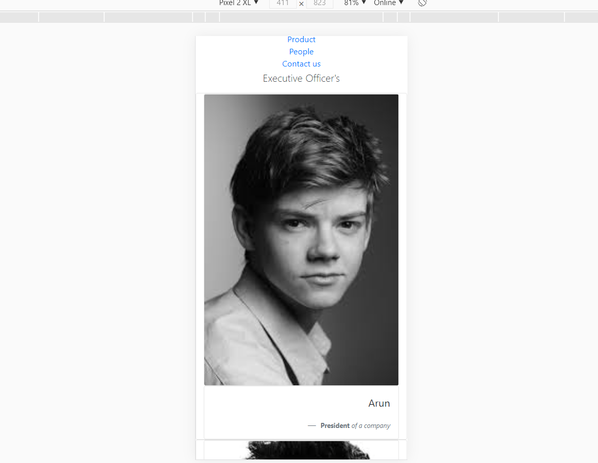
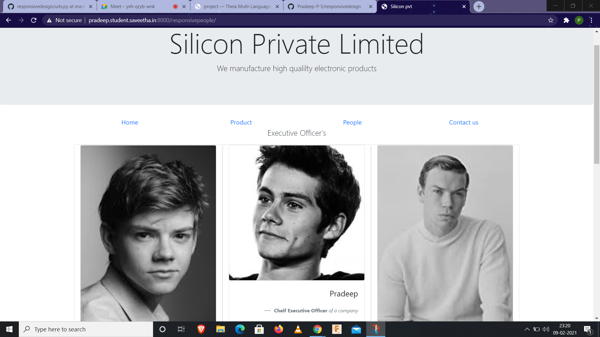

# Design of Responsive Website
## AIM:
To design a responsive website with two break points.

## DESIGN STEPS:
### Step 1: 
Requirement collection.
### Step 2:
Creating the layout using HTML and CSS.
### Step 3:
Updating the sample content.
### Step 4:
Choose the appropriate style and color scheme.
### Step 5:
Validate the layout in various browsers.
### Step 6:
Validate the HTML code.
### Step 7:
Create a database model and migrate the database.
### Step 8:
Retrieve data from database and display it in a dynamic webpage.
### Step 9:
Publish the website in the given URL.

## PROGRAM:


### responsivebase:
```

<!doctype html>
<html lang="en">
  <head>
    <!-- Required meta tags -->
    <meta charset="utf-8">
    <meta name="viewport" content="width=device-width, initial-scale=1, shrink-to-fit=no">

    <!-- Bootstrap CSS -->
    <link rel="stylesheet" href="https://maxcdn.bootstrapcdn.com/bootstrap/4.0.0/css/bootstrap.min.css" integrity="sha384-Gn5384xqQ1aoWXA+058RXPxPg6fy4IWvTNh0E263XmFcJlSAwiGgFAW/dAiS6JXm" crossorigin="anonymous">

    <title>Silicon pvt</title>
  </head>
  <body>
    <div class="jumbotron">
        <div class="container text-center">
            <h1 class="display-3">Silicon Private Limited</h1>
            <p class="lead">We manufacture high qualilty electronic products</p>
        </div>
    </div>
    <div class="container">
        <div class="row text-center">
            <div class="col-12 col-md-3"><a href="/responsivehome">Home</a></div>
            <div class="col-12 col-md-3"><a href="/responsiveproduct">Product</a></div>
            <div class="col-12 col-md-3"><a href="/responsivepeople">People</a></div>
            <div class="col-12 col-md-3"><a href="/responsivecontactus">Contact us</a></div>
        </div>
    </div>
    <div class="container">
        
    
    </div>
    <div class="container">
        <div class="row align-items-end">
            <div class="col text-center">
                Copyright © 2020 Silicon Private Limited, Developed by .Pradeep
            </div>
        </div>
    </div>
    <!-- Optional JavaScript -->
    <!-- jQuery first, then Popper.js, then Bootstrap JS -->
    <script src="https://code.jquery.com/jquery-3.2.1.slim.min.js" integrity="sha384-KJ3o2DKtIkvYIK3UENzmM7KCkRr/rE9/Qpg6aAZGJwFDMVNA/GpGFF93hXpG5KkN" crossorigin="anonymous"></script>
    <script src="https://cdnjs.cloudflare.com/ajax/libs/popper.js/1.12.9/umd/popper.min.js" integrity="sha384-ApNbgh9B+Y1QKtv3Rn7W3mgPxhU9K/ScQsAP7hUibX39j7fakFPskvXusvfa0b4Q" crossorigin="anonymous"></script>
    <script src="https://maxcdn.bootstrapcdn.com/bootstrap/4.0.0/js/bootstrap.min.js" integrity="sha384-JZR6Spejh4U02d8jOt6vLEHfe/JQGiRRSQQxSfFWpi1MquVdAyjUar5+76PVCmYl" crossorigin="anonymous"></script>
  </body>
</html>
```

### responsivehome:
```



<div class="card">
  
  <div class="card-body">
    <h5 class="card-title">About Us</h5>
    <p class="card-text">Silicon Pvt Ltd, provides a broad range of semiconductor and infrastructure software applications that serve the data center, networking, software, broadband, wireless, and storage and industrial markets. Common applications for its products include: data center networking, home connectivity, broadband access, telecommunications equipment, smartphones, base stations, data center servers and storage, factory automation, power generation and alternative energy systems, displays, and mainframe operations and management, and application software development. Some of Silicon's core technologies and products include:
    <ul>
        <li>Memory Chips</li>
        <li>SATA HDD</li>
        <li>SATA SSD </li>
        <li>Broadband Modems</li>
        <li>Wifi Devices</li>
        <li>Switching Devices</li>
        <li>Optical Sensors</li>
    </ul>
  </div>
</div>

```

### responsive product:
```



<div class="row text-center">
    <div class="col-12">
        <p class="lead">Our Premium Products</p>
    </div>
  
</div>
<div class="row text-center">
    <div class="card col-12 col-md-6 col-lg-3">
    
    <div class="card-body">
        <h5 class="card-title"><b> Black Revolve</b></h5>
        <p class="card-text">Price: Rs.9000.00 </p>
    </div>
    </div>
    <div class="card col-12 col-md-6 col-lg-3">
    
    <div class="card-body">
        <h5 class="card-title"><b>Black Band</b></h5>
        <p class="card-text"> Price: Rs.3000.00 </p>
    </div>
    </div>
    <div class="card col-12 col-md-6 col-lg-3">
    
    <div class="card-body">
        <h5 class="card-title"><b>Black 360</b></h5>
        <p class="card-text">Price: Rs.5000.00</p>
    </div>
    </div>
    <div class="card col-12 col-md-6 col-lg-3">
    
    <div class="card-body">
        <h5 class="card-title"><b>Black Horizon</b></h5>
        <p class="card-text">Price: Rs.25000.00 </p>
    </div>
    </div>
    <div class="card col-12 col-md-6 col-lg-3">
    
    <div class="card-body">
        <h5 class="card-title"><b>Black Note6</b></h5>
        <p class="card-text"> Price: Rs.35000.00</p>
    </div>
    </div>
    <div class="card col-12 col-md-6 col-lg-3">
    
    <div class="card-body">
        <h5 class="card-title"><b>Black Mini</b></h5>
        <p class="card-text">Price: Rs.5000.00</p>
    </div>
    </div>
    <div class="card col-12 col-md-6 col-lg-3">
    
    <div class="card-body">
        <h5 class="card-title"><b>Black Bass Head</b></h5>
        <p class="card-text">Price: Rs.4000.00</p>
    </div>
    </div>
    <div class="card col-12 col-md-6 col-lg-3">
    
    <div class="card-body">
        <h5 class="card-title"><b>Black TWS</b></h5>
        <p class="card-text">Price: Rs.7000.00</p>
    </div>
    </div>
    <div class="card col-12 col-md-6 col-lg-3">
    
    <div class="card-body">
        <h5 class="card-title"><b>Black 11 in 1</b></h5>
        <p class="card-text"> Price: Rs.6000.00</p>
    </div>
    </div>
    <div class="card col-12 col-md-6 col-lg-3">
    
    <div class="card-body">
        <h5 class="card-title"><b>Black Z6 Chip</b></h5>
        <p class="card-text"> Price: Rs.25000.00</p>
    </div>
    </div>
    <div class="card col-12 col-md-6 col-lg-3">
    
    <div class="card-body">
        <h5 class="card-title"><b>Black power bank</b></h5>
        <p class="card-text">Price: Rs.2,000.00</p>
    </div>
    </div>
    <div class="card col-12 col-md-6 col-lg-3">
    
    <div class="card-body">
        <h5 class="card-title"><b>Black neck band</b></h5>
        <p class="card-text">Price: Rs.2000.00</p>
    </div>
    </div>
</div>

```

### responsive people:
```



<div class="row text-center">
    <div class="col-12">
        <p class="lead">Executive Officer's</p>
    </div>
</div>
    <div class='row text-center'>
        <div class="card col-12 col-md-6 col-lg-4">
            <div class="card">
                
            </div>
            <div class="card p-3 text-right">
                <blockquote class="blockquote mb-0">
                    <p>Arun</p>
                    <footer class="blockquote-footer">
                        <small class="text-muted">
                            <b>President</b> <cite title="Source Title">of a company</cite>
                        </small>
                    </footer>
                </blockquote>
            </div>
        </div>
        <div class="card col-12 col-md-6 col-lg-4">
            <div class="card">
                
            </div>
            <div class="card p-3 text-right">
                <blockquote class="blockquote mb-0">
                    <p>Pradeep</p>
                    <footer class="blockquote-footer">
                        <small class="text-muted">
                            <b>Cheif Executive Officer</b> <cite title="Source Title">of a company</cite>
                        </small>
                    </footer>
                </blockquote>
            </div>
        </div>
        <div class="card col-12 col-md-6 col-lg-4">
            <div class="card">
                
            </div>
            <div class="card p-3 text-right">
                <blockquote class="blockquote mb-0">
                    <p>Ashwin</p>
                    <footer class="blockquote-footer">
                        <small class="text-muted">
                            <b>Cheif Operating Officer</b> <cite title="Source Title">of a company</cite>
                        </small>
                    </footer>
                </blockquote>
            </div>
        </div>
        <div class="card col-12 col-md-6 col-lg-4">
            <div class="card">
                
            </div>
            <div class="card p-3 text-right">
                <blockquote class="blockquote mb-0">
                    <p>Surya</p>
                    <footer class="blockquote-footer">
                        <small class="text-muted">
                            <b>Cheif Financial Officer</b> <cite title="Source Title">of a company</cite>
                        </small>
                    </footer>
                </blockquote>
            </div>
        </div>
        <div class="card col-12 col-md-6 col-lg-4">
            <div class="card">
                
            </div>
            <div class="card p-3 text-right">
                <blockquote class="blockquote mb-0">
                    <p>Saran</p>
                    <footer class="blockquote-footer">
                        <small class="text-muted">
                            <b>Cheif Legal Officer</b> <cite title="Source Title">of a company</cite>
                        </small>
                    </footer>
                </blockquote>
            </div>
        </div>
        <div class="card col-12 col-md-6 col-lg-4">
            <div class="card">
                
            </div>
            <div class="card p-3 text-right">
                <blockquote class="blockquote mb-0">
                    <p>Vibheesh</p>
                    <footer class="blockquote-footer">
                        <small class="text-muted">
                           <b>Cheif Marketing Officer</b><cite title="Source Title">of a company</cite>
                        </small>
                    </footer>
                </blockquote>
            </div>
        </div>
    </div>
    
```

### responsive contactus:
```



<div class="card">
  <div class="card-body">
    <div class="card-title"><h5 class="col text-center">Contact Us</h5></div>
    <p class="card-text">
        <hr>
        <div class="col text-center">
        <h4 class="lead">Email: siliconcompany@gmail.com</h4><br>
        <h4 class="lead">Phone: +91-9123456780</h4><br>
        <h4 class="lead">Address: © Silican pvt,Mountain View, California, United-States</h4>
        </div>
        <hr>
  </div>
</div>

```

## OUTPUT:

## OUTPUT:








## CODE VALIDATION REPORT:


## RESULT:
Thus a website is designed for the responsive website with two break points and is hosted in the URL http://pradeep.student.saveetha.in:8000/. HTML code is validated.